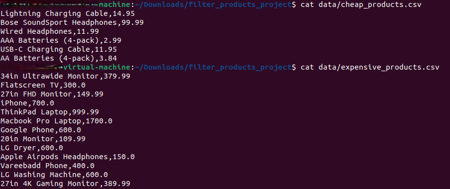

Since your data/ folder contains an additional file, sorted_products.csv, let's update the README.md to reflect that. I'll include a brief description of its purpose and where it fits in the project.
Filter Products - Assignment 03
Description

This project filters IT product data from a CSV file into two separate files:

    cheap_products.csv → Products costing less than $100
    expensive_products.csv → Products costing $100 or more

Additionally, the project includes sorted_products.csv, which contains product data sorted by price.

The program asks the user to enter a filename, extracts product names and prices using get_prices (from Assignment 02), and categorizes the products accordingly.
Prerequisites

Before running this program, ensure you have:

    Python 3.x installed
    The CSV file (IT_products.csv) in the correct directory
    get_prices function implemented in assignment_02.py

Installation & Usage
1️⃣ Clone or Download the Repository

git clone https://github.com/your-repo/filter_products.git
cd filter_products

2️⃣ Check the CSV File (Optional but Recommended)

Before filtering products, use read_and_print.py to verify the CSV file format.

Run:

python read_and_print.py

Example Output:

Product: Laptop, Price: 999.99
Product: Mouse, Price: 25.50
Product: Keyboard, Price: 49.99
...

This ensures the file is readable and correctly formatted.
3️⃣ Run the Filtering Script

python filter_products.py

4️⃣ Enter the Filename

When prompted, enter the name of the CSV file (e.g., IT_products.csv).

5️⃣ Check the Output Files

Filtered products will be saved in the data/ folder:

    data/cheap_products.csv
    data/expensive_products.csv
    data/sorted_products.csv → Products sorted by price (if applicable).

File Structure

📂 filter_products_project

 ├── 📂 data
 
 │   ├── cheap_products.csv
 
 │   ├── expensive_products.csv
 
 │   ├── sorted_products.csv  # Sorted product list by price
 
 
 ├── assignment_02.py  # Contains get_prices function
 
 ├── filter_products.py  # Main script
 
 ├── IT_products.csv  # Input file
 
 ├── read_and_print.py  # CSV validation script
 
 ├── README.md  # Documentation
 

Implementation Details

    The script reads product data from the user-specified file using get_prices.
    It categorizes products based on their price.
    It writes the filtered data into two separate CSV files while maintaining the original format.
    sorted_products.csv is an additional file that may be created if sorting is applied.
    Error handling ensures that invalid filenames do not crash the program.

Example Run

Input:

Enter the file name: IT_products.csv

Output:

Filtering complete. Files saved in 'data' folder.

Dependencies

    Python’s built-in csv module is used (no extra installations required).

Author

    Maria vittoria 
    Course: CodingLab @ Luiss
    Date: January 2025
